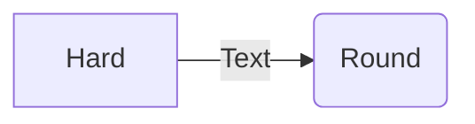

# hello java

> java
## test1
des
## test2

```mermaid
graph LR
A[Hard] --> |Text| B(Round)
```

[luckysheet](./new-sheet.luckysheet){link-type="luckysheet"}

[Drawio](./new-diagram.drawio){link-type="drawio"}
